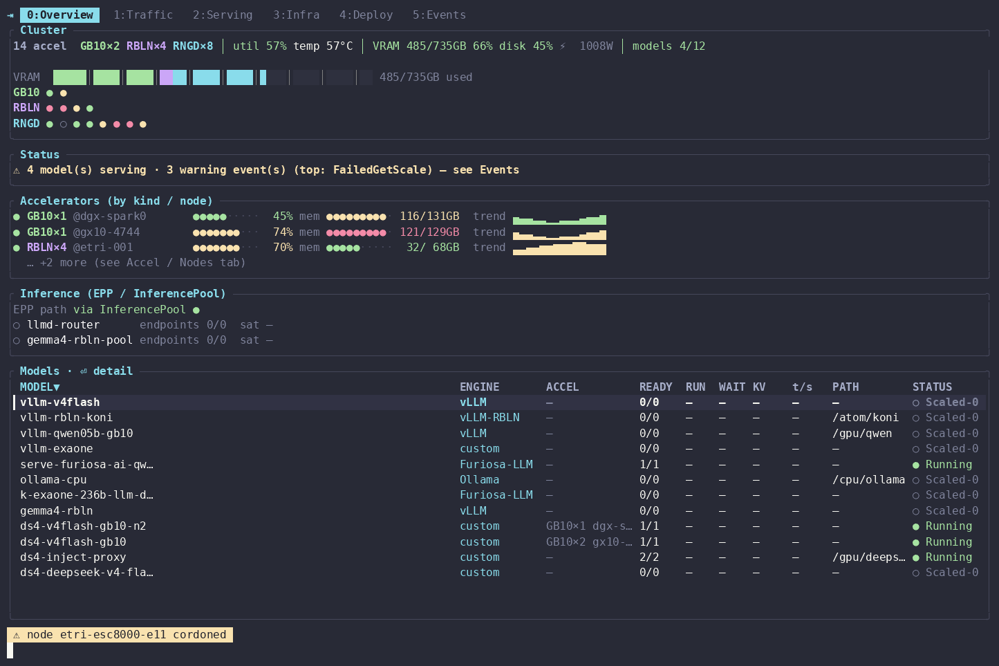

# lmd-top

> **A terminal observability & operations tool for [llm-d](https://llm-d.ai) clusters.**
> See the whole serving stack — Gateway, EPP routing, model servers, and heterogeneous accelerators — on one screen, from a single static binary.

**English** · [한국어](README.ko.md)

[](https://github.com/gspark-etri/lmd-top/releases/latest)
[](LICENSE)


`lmd-top` correlates the four layers of an llm-d serving stack — Gateway → EPP (Endpoint
Picker) → model server → infrastructure — across heterogeneous accelerators (NVIDIA GPU,
Rebellions RBLN, Furiosa RNGD, and host CPU). It reads your existing Prometheus and
Kubernetes; it stores no data of its own.

## Demo



<sub>Soft (Catppuccin) theme, live braille timelines, and cross-layer drill-down. Regenerate with `lmd-top --cast && agg docs/demo.cast docs/demo.gif`.</sub>

## Highlights

- **Four layers on one screen.** The Gateway, EPP/InferencePool, model servers, and hardware are correlated, so you can answer *which model runs where, how requests are routed, and how load is distributed* without switching tools.
- **Heterogeneous accelerators, unified.** NVIDIA GPU, Rebellions RBLN, and Furiosa RNGD sit side by side. The exact GPU model and its VRAM are auto-detected, unified-memory parts (GB10, GH200) are recognized and marked `∪`, and per-node disk usage is tracked too.
- **EPP-aware.** It reads the EPP `ConfigMap` (active scorers, weights, and picker), visualizes routing decisions and per-pod queues, and diagnoses whether an HTTPRoute actually flows through the InferencePool or bypasses it.
- **Deployment lifecycle.** The Deploy section splits into two lenses over one `family › version › target` tree: **Serving** (what is running now — compiled target, replicas, node, throughput) and **Library** (what you can deploy — catalog feasibility, placement capacity, RBLN/Furiosa compile jobs). Same tree, one `Tab` apart.
- **A rich terminal UI.** An LED device grid, a stacked VRAM bar, braille timelines, active alerting, log tailing, and a `scale` action — with four themes and understated animations, all in a single static Rust binary that has no C dependencies.

## Views

Navigation has two axes that mirror the request path (Gateway → EPP → Model → Infra):
pick a **section** with the number keys `0`–`5` (or cycle with `Tab` / `Shift+Tab`), then cycle
its **sub-tabs** with `←` / `→` (or `[` / `]`). In multi-panel views, `Ctrl+w` enters panel-focus
mode (then `h`/`j`/`k`/`l` or arrows move focus, `Esc` exits) — the vi/tmux window model.

| # | Section | Sub-tabs | Shows |
|---|---|---|---|
| 0 | **Overview** | — | Cluster summary, LED device grid, VRAM bar, accelerators by kind/node, EPP path, models, and a one-line diagnosis |
| 1 | **Traffic** | Flow · EPP | **Flow**: Gateway → HTTPRoute → backend → pods, with InferencePool/EPP/SLO and the EPP-bypass diagnosis (`⏎` jumps to the backend model). **EPP**: scorers/weights, the picker, InferencePool endpoints, and request distribution |
| 2 | **Models** | Models · Perf · Pods | **Models**: per-model accel/node, ready, running/waiting, KV%, tok/s, route, status. **Perf**: p95 latency QUEUE→PREFILL→DECODE→TPOT→E2E, tok/s, + SLO advisor. **Pods**: `llm-serving` pods (ready/phase/node/restarts). `⏎` opens the action menu |
| 3 | **Infra** | Nodes · Devices · Topology | **Nodes**: health (CPU/mem/disk/load + devices). **Devices**: per-device util/VRAM/temp/power. **Topology**: Canvas Gateway→EPP→Pool flow + device pressure heatmap |
| 4 | **Deploy** | Serving · Library | Two lenses over one `family › version › target` tree. **Serving**: what is running now — state, compiled target, replicas, `@node`, tok/s (`⏎` → Stop/Scale/Restart/YAML/Logs). **Library**: what you can deploy — catalog feasibility (`✓ ready` / `⚙ needs-compile` / `✗ no-capacity`) + placement targets, with in-flight compile jobs (`⏎` → Deploy/Compile). Single-child version tiers collapse automatically |
| 5 | **Events** | — | Kubernetes + llm-d events, newest first; `⏎` shows the full message |

List headers show a `Σ` aggregate of the shown rows (all rows, or just the filtered ones). `y` shows any selected resource's live YAML (read-only).

## Install

**Prebuilt binary** (Linux x86_64):

```bash
VER=v0.34.0   # latest: https://github.com/gspark-etri/lmd-top/releases/latest
curl -fsSL "https://github.com/gspark-etri/lmd-top/releases/download/$VER/lmd-top-$VER-x86_64-linux.tar.gz" | tar xz
sudo install -m 0755 lmd-top /usr/local/bin/
```

A `.sha256` checksum is published alongside each release asset.

**From source** (needs a Rust toolchain and a C linker, `cc`/`gcc` — nothing else):

```bash
git clone https://github.com/gspark-etri/lmd-top.git && cd lmd-top
./install.sh                 # installs any missing prereqs, then runs `cargo install`
#   ./install.sh --check     # report what's present/missing, install nothing
#   ./install.sh --with-demo # also install agg and regenerate the demo GIF
# by hand: cargo install --path .
```

**Runtime requirements:**

- `kubectl` with kubeconfig access, and network reachability to Prometheus. It never SSHes into accelerator nodes.
- A truecolor terminal with a font covering box-drawing and braille glyphs is recommended; otherwise run with `LMD_THEME=default`.
- The binary links only glibc — no OpenSSL, pkg-config, or cmake. `xdg-open` is optional (used only by the `g` key).

## Usage

```bash
lmd-top                      # launch the TUI (permission mode: observe)
lmd-top --mode admin         # allow operational actions (scale / restart / apply)
lmd-top --json               # print machine-readable agent state (JSON)
lmd-top --doctor             # survey Prometheus: exporters, metric coverage, gaps
lmd-top --audit              # print the audit log of applied mutations
lmd-top --snapshot | --render | --cast   # headless text / CI render / demo asciicast
LMD_PROM=10.0.0.5:30090 LMD_NS=my-ns lmd-top   # point at another cluster
```

**Permission modes** (`--mode`, shown as a header badge) gate actions:
`observe` (default, view only) → `debug` (adds logs, `l`) → `admin` (scale, restart, stop,
compile/deploy apply, cordon, route rename/retarget) → `danger` (delete pod/job/route rule).
Mutating actions open a confirmation popup that defaults to **No**.
Every applied mutation (scale, stop, restart, cordon, delete, route edit, apply) is appended
to an **audit log** (`~/.config/lmd-top/audit.log`, or `$LMD_AUDIT`) with timestamp, mode,
action, target, and result — view it with `lmd-top --audit`.

**Keys.**

| | |
|---|---|
| Navigate | `0-5`/`Tab` section · `←`/`→` (`[ ]`) sub-tab · `Ctrl+w` then `hjkl`/arrows panel focus · `↑↓`/`kj` select · `g`/`G` top/bottom · `Ctrl+u`/`Ctrl+d` half-page · `Esc` back |
| Act | `⏎`/`a` action menu (drill when none) · `p i r e m` cross-layer pivot (also in the menu as **Go: …**) · `/` filter · `:` command palette (jump to any view / run any display action) · `o`/`O` sort column / direction · `y` live YAML · `l` logs · menu → Compile/Deploy/Scale/Restart/Stop/Delete/Cordon/Objective (mode-gated `⊘`, default-No confirm) |
| Display | `t` theme · `f` animations · `z` zoom · `Space` pause · `A` alerts · `?` help · `q` quit · `:graf` Grafana · `R` reset session energy |

**Environment.**

- `LMD_PROM`, `LMD_NS` (default `llm-serving`), `LMD_GRAFANA` — point it at your cluster.
- `LMD_THEME` — startup theme: `soft`, `default`, `high-contrast`, or `colorblind`.
- `LMD_AUDIT` — audit log path (default: `~/.config/lmd-top/audit.log`).
- `LMD_W` / `LMD_H` — the `--render` size.
- `LMD_COMPILE_IMAGE_RBLN`, `LMD_COMPILE_IMAGE_FURIOSA`, `LMD_SERVING_IMAGE` — container images for the generated compile/deploy manifests. Until set, those fields are `TODO-…` placeholders and the in-app apply (`a`) is blocked; `w` still saves the manifest to edit by hand.
- `LMD_SAVE_DIR` — where `w` writes saved manifests (default: current dir).
- Optional `~/.config/lmd-top/lmd-top.yaml` customizes column order.

**Colors and glyphs.** Color encodes severity or identity, while state is carried by a
separate glyph (`●` up, `○` idle, `◐` pending, `⚠` throttling, `⊘` cordoned, `✗` down) so the
UI stays legible in the colorblind theme. Metrics that aren't present yet render as `–` and
fill in once the workload is up.

## Data path

lmd-top reads your existing stack and correlates it; it owns no data.

| Layer | Source | Examples |
|---|---|---|
| Accelerators / host | Prometheus | `DCGM_FI_DEV_*`, `RBLN_DEVICE_STATUS:*`, `furiosa_npu_*`, `node_*` |
| Model server | Prometheus | `vllm:*_latency_seconds_bucket`, `vllm:num_requests_*`, `vllm:*kv_cache*` |
| EPP / Pool | Prometheus + ConfigMap | `inference_pool_*`, `inference_extension_*`, `llmd-router-epp` cm |
| Topology / status / actions | `kubectl` | Deployment, Pod, HTTPRoute, Gateway, InferencePool, InferenceObjective |

Data arrives on two tiers: a fast tier (~1 s) for accelerators and nodes, and a full
snapshot (~3 s) for everything else. It's pure Rust — Prometheus is queried over raw `tokio`
HTTP/1.0, and Kubernetes through `kubectl`.

## Status & roadmap

**Works today, with no traffic required.** All twelve views; GPU/RBLN/RNGD and node/disk
monitoring with auto-detection and unified memory; the Flow topology and EPP-bypass
diagnosis; EPP ConfigMap introspection; active alerting; the `scale` and `logs` actions; the
Deploy section's Serving/Library lenses (running deployments, catalog feasibility, and
RBLN/Furiosa compile & deploy manifest generation with a mode-gated apply); the headless
`--json`, `--doctor`, `--snapshot`, and `--cast` modes; and themes, animation, zoom, and
permission modes.

**Fills in once real traffic flows through the EPP and vLLM exposes metrics.** Per-model p95
latency breakdown, tok/s, per-pod queue distribution, KV%/TTFT/E2E, and EPP request
distribution. (The EPP weight `+`/`-` is a local weight-share simulation — it does not apply
to the cluster.)

**Planned.** Applied control-plane actions beyond the current apply flow (endpoint drain,
traffic/policy-weight apply, and rollout, each as dry-run → confirm → audit) and an EPP
per-endpoint score debugger. (NPU **compile & deploy automation** — generating RBLN/Furiosa
compile Jobs and serving Deployments from the Deploy view, gated by permission mode — has
since shipped; see Highlights.) See [ROADMAP.md](ROADMAP.md) and [CHANGELOG.md](CHANGELOG.md).

## Maturity

Verified against a live heterogeneous cluster (8 nodes; GB10, RBLN, and RNGD accelerators;
EPP, routes, and models live). It's experimental (0.x), so interfaces may still change.

## Contributing & license

Issues and pull requests are welcome — see [CONTRIBUTING.md](CONTRIBUTING.md).
Licensed under [Apache-2.0](LICENSE).
